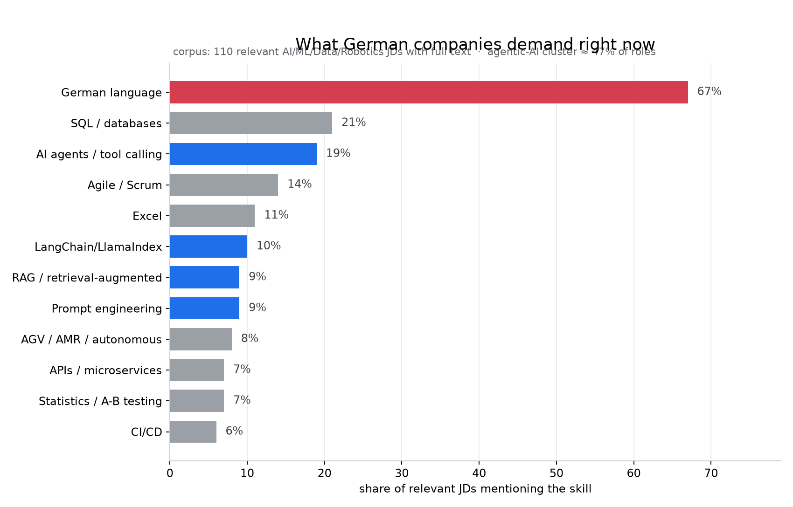

# 🇩🇪 German AI Job Radar

**I stopped guessing what the German AI job market wants and measured it instead.**
This tool scrapes ~3,000 live German job listings, extracts the full job descriptions,
scores every relevant AI/ML/Data/Robotics role against a resume keyword profile, and
mines the corpus for skill-demand statistics.



> Headline finding (corpus of ~3,000 listings, Sept 2026): **German is demanded
> explicitly in ~67% of relevant AI roles with full JD text (97 Werkstudent /
> 13 Junior).** The fastest-growing skill cluster for AI student roles is
> agentic AI (agents/tool-calling 19%, LangChain 10%, RAG 9%). Full methodology below.

## What it does

```
┌─────────────┐   ┌──────────────┐   ┌───────────────┐   ┌──────────────┐
│  4 sources  │ → │  SQLite DB   │ → │ resume-profile │ → │ ranked CSVs  │
│ StepStone   │   │ dedup by URL │   │ scoring (41    │   │ + market     │
│ Indeed/LinkedIn │ │ (title+co in │  │ skills, weighted) │ │ reports +   │
│ Arbeitnow API│  │  fallback)   │   │ + track split  │   │ topic mining │
│ saved HTML  │   └──────────────┘   └───────────────┘   └──────────────┘
└─────────────┘
```

- **Scrapers** — StepStone (plain `requests`, JSON-LD detail parsing), Indeed/LinkedIn
  via [`python-jobspy`](https://github.com/serpapi/python-jobspy), Arbeitnow's free
  API, and a browser-saved-HTML fallback for blocked IPs
- **Scoring** — every JD is matched against **your** weighted skill profile
  (Strong / Partial / Missing per skill) → per-job fit score + "what's missing for me"
- **Two tracks** — `student` (Werkstudent/Praktikum) vs `fulltime` (Junior/Graduate),
  classified from titles + entry-level JD signals; senior roles excluded
- **Topic mining** — 40+ topic demand counts (RAG, vector DBs, ROS 2, edge AI,
  German…) split by segment, by track, and aligned to your skill levels
- **Dual-track employers** — companies hiring both students *and* juniors
  (= Werkstudent → Übernahme pipelines)

## Bring your own resume — `profile.json`

The radar is **not** hard-wired to one candidate. Everything personal lives in a
single editable file at the project root (the shipped copy is the author's starter —
edit it or drop in your own):

```jsonc
{
  "name": "Your name / label",
  "about": "notes…",
  "tracks": {
    "student":  ["Werkstudent Machine Learning", "Werkstudent AI"],
    "fulltime": ["Junior Machine Learning Engineer", "Junior Data Scientist"]
  },
  "cities": ["Berlin", "München", "Stuttgart"],
  "keywords": {
    "Python":     { "weight": 3, "patterns": ["python"],                 "level": "strong" },
    "PyTorch":    { "weight": 3, "patterns": ["pytorch"],                "level": "novice" },
    "LangChain/AI agents": {
      "weight": 2, "patterns": ["langchain", "langgraph", "agentic", "multi-?agent"], "level": "partial" },
    "German (B1+)": { "weight": 3, "patterns": ["\\bdeutsch\\b(?!land)", "\\bgerman\\b"], "level": "partial" }
  },
  "topics": { "RAG / retrieval-augmented": "partial", "ROS / ROS 2": "strong" }
}
```

- `keywords.level`: `strong` (1.0 credit) · `partial` (0.5) · `novice` (0.25) · `none` (0) — the fit %
  is your credit-weighted coverage of what the JD demands
- `keywords.weight` 3/2/1 = how much a missing/partial skill hurts you in market reports
- `tracks` + `cities` = what the scrapers search for **you**
- `topics` = your levels per demand topic → drives the "Your level / Learn-priority" columns
- `patterns` are treated as regexes; edit until they match how German postings phrase things

Ways to use it:
```bash
python job_radar.py                          # uses ./profile.json for scoring + searches
python job_radar.py --profile my_profile.json
```
In the web app (`python app.py`) it's editable live: **Configure → Your profile** textarea
→ Save & re-score, no restart needed. Clone the repo, point the profile at yourself, and
the Explore + Market-insights views become *your* ranked shortlist and *your* skill gaps.

## Quick start

```bash
pip install -r requirements.txt
python job_radar.py                              # all sources, both tracks
python job_radar.py --no-scrape                  # rescore stored jobs only
python job_radar.py --sources stepstone,fromhtml # subset of sources
python job_radar.py --no-scrape --enrich-stepstone  # upgrade teaser JDs to full text

python topic_demand.py        # skill-demand mining over the collected corpus
python cleanup_db.py          # collapse duplicate listings across sources (maintenance)
```

Outputs land in `output/`: ranked CSVs per track, market reports per track,
`topic_demand_report.md`.

## Repo layout

| File | Purpose |
|------|---------|
| `profile.json` | **your** profile: skill levels, weights, search terms, cities (edit me) |
| `job_radar.py` | main pipeline: scrape → dedup → score → report |
| `stepstone.py` | StepStone search + JSON-LD detail scraper (verified 2026 markup) |
| `indeed_direct.py` | Indeed direct requests + saved-HTML parser (Cloudflare-aware) |
| `topic_demand.py` | topic/skill demand mining over the JD corpus |
| `cleanup_db.py` | one-time migration: rebuild canonical URL-hash keys, merge dupes |
| `data/sample_jobs.csv` | 10-row sample of the schema |

## Fair-use & legal notes

- Built for **personal, low-volume job hunting**. Sources are hit politely
  (delays, per-run caps). StepStone/Indeed/LinkedIn ToS generally prohibit
  scraping — don't run this hourly, don't republish scraped data, don't use it
  commercially.
- The DB (`jobs.db`) is **not** included — run your own scrape in minutes.

## Built by

An M.Sc. Artificial Intelligence & Robotics student (Hof University, Germany),
hunting Werkstudent roles and building in public.
